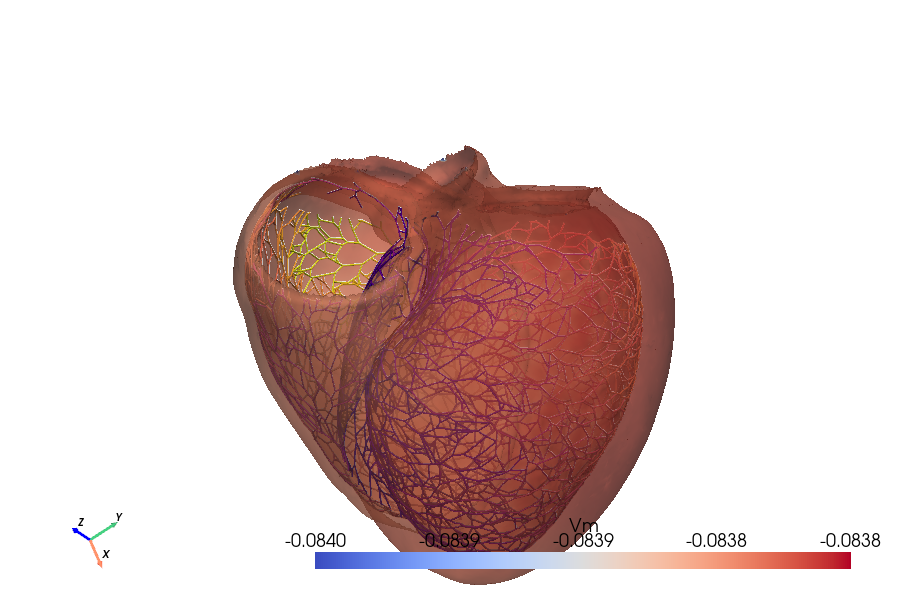

# 4Dpapers

**Write scientific papers where the 3D figures stay alive.** Rotate them, switch fields, and scrub through time right in the browser — then export the whole paper to HTML or PDF.



### ▶ [See a live paper in your browser](https://4dpapers.github.io/4dpapers/) — no install, just click

---

## Run it yourself in one command

You need [Docker](https://docs.docker.com/get-docker/). Then:

```bash
git clone https://github.com/4dpapers/4dpapers.git
cd 4dpapers
cp .env.example .env
IMAGE=ghcr.io/4dpapers/4dpapers:latest FOURD_WORKSPACE=./examples/niederer docker compose up
```

Open **http://localhost:5006** — you'll land in the editor with the example cardiac
paper already loaded and its 3D figures live. Rotate a figure, switch its field, press ▶ to animate.

That's the whole app: a file tree, a Markdown editor, and a live preview, in one browser tab.

---

## Make your own figure

A paper is a Quarto Markdown file (`.qmd`). Drop your data under `data/`, then add one shortcode:

```markdown

```

Click **Compile** in the dashboard and the figure appears — interactive in HTML, a static
snapshot in PDF. That's the core loop: **add data → write a shortcode → compile.**

Supported data: `.foam`, `.vtu`, `.vtp`, `.pvd`, `.vtk`, `.xdmf`, `.stl`, `.obj`, `.ply`,
`.cgns`, `.exo`, `.case`, `.msh`, `.med`, `.inp`, and Plotly `.json`.
See the [full shortcode & format reference](AGENTS.md).

---

## What you can do

- **Interactive 3D figures** for simulation and mesh data, with live field switching (`U`, `p`, `T`, `Vm`, …)
- **Time animation** for multi-step datasets — a ▶ button appears automatically
- **Multi-panel and time-series layouts** with synchronized cameras
- **HTML and PDF export** from the same source
- Optional AI sidebar and signed HTML output

---

## Use your own paper

Point the app at any folder on your machine instead of the example:

```bash
FOURD_WORKSPACE=/path/to/your/project docker compose up
```

If the folder has no paper yet, 4Dpapers scaffolds a starter Quarto project. For the smoothest
workflow, open that same folder in your IDE while Docker runs the app — you edit files on the host,
the app renders them. See [Using 4Dpapers with an IDE](docs/ide-workflow.md).

A typical project looks like:

```text
your-project/
├── main.qmd          # the paper (Quarto Markdown)
├── sections/         # reusable content included by main.qmd
├── data/             # your simulation / mesh data
├── references.bib
├── _quarto.yml
├── state/            # generated runtime state
└── _output/          # compiled HTML / PDF
```

---

## Configuration

Copy `.env.example` to `.env` and change only what you need. The common ones:

| Variable | Purpose |
|---|---|
| `PORT` | Dashboard port, default `5006` |
| `FOURD_WORKSPACE` | Host paper folder mounted at `/workspace` |
| `FOURD_API_KEY` | API key for dashboard/API access (set a strong one for any remote deployment) |
| `FOURD_ALLOWED_ORIGIN` | Allowed browser origin for CORS |
| `OPENAI_API_KEY`, `ANTHROPIC_API_KEY`, `GEMINI_API_KEY` | Enable AI providers |

Full list: [`.env.example`](.env.example).

---

## Deploying to a server

4Dpapers is **single-tenant** — one workspace, one user. It's built to run locally or on a private
host, not as a multi-user service. To put it behind HTTPS on a single Docker host (Caddy terminates
TLS in front of the app):

```bash
cp .env.production.example .env.production
$EDITOR .env.production        # set a strong FOURD_API_KEY
docker compose --env-file .env.production -f docker-compose.yml -f docker-compose.prod.yml up -d
```

This binds the app to `127.0.0.1:5006`, serves it publicly through Caddy on `80/443`, and drops the
app to an unprivileged user after startup. Serve it over HTTPS and treat the API key as a
deployment secret, not multi-user auth. Details: [Docker deployment guide](docs/docker-deployment.md).

---

## Troubleshooting

| Symptom | Try |
|---|---|
| Dashboard does not load | `docker compose logs -f` |
| Fields are missing | Check that `fields="..."` matches the data array names exactly |
| Mesh looks too simplified | Add `decimate="none"` to the shortcode |
| XDMF fails to load | Keep the companion `.h5` file next to the `.xdmf` |
| Volume permission error | Check host folder permissions |

---

## License

Source-available under a dual-license model:

- Free for non-commercial research and educational use
- Paid commercial license required for company/internal commercial use

See [LICENSE.md](LICENSE.md).
