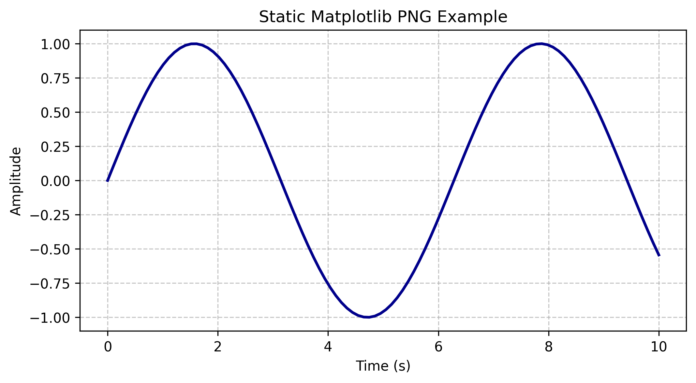

# 4DPapers Frontend Contract Schema

**Status**: Living document for 4D papers shortcode and text injection API
**Last updated**: 2026-04-07
**Audience**: Writers (QMD files), schema architects, frontend developers

---

## 0. Folder Shortcuts & Data Decoupling

### Overview

The folder shortcuts system allows you to reference external data directories using simple `@shortcut_name` syntax in `.qmd` files, eliminating hardcoded absolute paths and enabling data portability.

**Problem**: Hardcoded paths break when code/data moves between machines:
```markdown
# ❌ Breaks on different machine

```

**Solution**: Define shortcuts in `_shortcuts.yml`, reference with `@` syntax:
```markdown
# ✅ Works on any machine (if data path is configured)

```

### Quick Start

**Step 1**: Copy the template and customize:
```bash
cp _shortcuts.example.yml _shortcuts.yml
# Edit _shortcuts.yml with your data paths
```

**Step 2**: Use `@shortcut_name/path` in shortcodes:
```markdown




```

**Step 3**: View shortcuts in dashboard:
- Open dashboard
- Look for "Shortcuts" section in left panel (below Explorer header)
- Click a shortcut to copy `@name/` to clipboard

### Configuration: `_shortcuts.yml`

**Format**:
```yaml
shortcuts:
  shortcut_name:
    path: "/absolute/or/relative/path"
    description: "Human-readable description"
```

**Examples**:
```yaml
shortcuts:
  # Absolute path (HPC simulation results)
  sim_main:
    path: "/Users/simaocastro/cardiacFoamEP/NiedererEtAl2012"
    description: "Primary Niederer benchmark case"

  # Relative path (portable, resolved from project root)
  test_data:
    path: "./test_data"
    description: "Small test cases for CI/testing"

  # Symlink path (auto-updates when HPC reruns data)
  sim_latest:
    path: "/data/simulations/latest_run"
    description: "Latest simulation (symlinked for auto-updates)"

  # External analysis results
  graphs:
    path: "/shared/research/plotly_outputs"
    description: "Pre-computed Plotly graphs"
```

**Rules**:
- Shortcut names: lowercase alphanumeric + underscore only (`[a-z0-9_]`)
  - ✅ Good: `sim_main`, `test_data_v2`
  - ❌ Bad: `Sim-Main`, `test.data`
- Paths: absolute or relative (relative resolved from project root)
- Descriptions: optional but recommended
- File is git-ignored (machine-specific)

### Symlinks for Auto-Updating Data

When uploading simulation data via "Insert Figure" dialog:
- **Symlink created** (default): `data/case_name` → external folder
- **Benefit**: If HPC reruns simulation, new results available automatically
- **Fallback**: If symlink fails, data is copied instead

### Shortcut Syntax in Shortcodes

All shortcode `src=` parameters support `@shortcut_name/path` syntax:

```markdown

```

Equivalent to:
```markdown

```

**Subpath expansion**:
```yaml
shortcuts:
  data:
    path: "/external/data"
```

```markdown
# Both valid:


```

### Dashboard Shortcuts Visualization

The dashboard displays a simple "connection graph" showing:
- **Left**: Shortcut names (blue circles)
- **Middle**: Connection arrows
- **Right**: Folder paths

**Interactive features**:
- Click any shortcut → copies `@name/` to clipboard
- Hover → see full path
- Refresh button → reloads shortcuts from config

### Portability & Machine Differences

**Same machine, different users**:
- Each user has their own `_shortcuts.yml` (git-ignored)
- Points to their own data directories

**Different machines, shared codebase**:
- **Relative paths** (`./test_data`): portable automatically
- **Absolute paths** (`/path/to/data`): require user setup (document in README)
- **Example**: Provide `_shortcuts.example.yml` showing expected structure

**Sharing papers**:
- PDF exports use static PNGs (no path dependencies)
- Share `.qmd` + `_shortcuts.yml` (recipient configures for their setup)
- Or: Include metadata in `.qmd` frontmatter listing required shortcuts

### API Endpoints (for integration)

```bash
# List all shortcuts
curl http://localhost:5006/api/shortcuts

# Create/update shortcut
curl -X POST http://localhost:5006/api/shortcuts \
  -H "Content-Type: application/json" \
  -d '{"name": "sim_new", "path": "/data/new_case", "description": "New case"}'

# Resolve shortcut reference
curl "http://localhost:5006/api/shortcuts/resolve?src=@sim_main/Niederer.foam"
```

---

## 1. Document Structure & Text Injection

### Root Document: `analysis_report.qmd`

The main Quarto file uses `` directives to inject sections.

```yaml
---
title: "Cardiac Electrophysiology Analysis"
subtitle: "Niederer et al. (2012) Benchmark"
author:
  - name: "Your Name"
    affiliation: "Your Institution"
date: today
abstract: |
  Replace this with your abstract...
format:
  html:
    format-links: false
    code-fold: true
    toc: true
    toc-depth: 3
    theme:
      light: cosmo
      dark: darkly
  pdf:
    keep-tex: false
jupyter: python3
bibliography: references.bib
---





```

#### Sections & Default Content

| Section | File | Purpose | Editable | Default Figures |
|---------|------|---------|----------|-----------------|
| 1. Introduction | `sections/01_introduction.qmd` | Literature context, problem statement | ✓ Yes | None (static text) |
| 2. Simulation Setup | `sections/02_simulation_setup.qmd` | Methods, parameters, domain setup | ✓ Yes | None (static text) |
| 3. Results | `sections/03_results.qmd` | All interactive/static figures | ✓ Yes | See Section 2 below |
| 4. Conclusion | `sections/04_conclusion.qmd` | Discussion, implications, future work | ✓ Yes | None (static text) |

### Adding Custom Sections

You can easily extend the document with additional sections. This is useful for:
- Adding a **Methods** section (if not covered in Simulation Setup)
- Adding a **Discussion** section (beyond Conclusion)
- Adding a **Supplementary Materials** section with extra figures
- Splitting large sections (e.g., splitting Results into Results + Analysis)
- Adding a **Appendix** or **Mathematical Formulation** section

#### How to Add a Custom Section

**Step 1: Create a new `.qmd` file in the `sections/` directory**

Choose a naming convention. Standard practice is to use two-digit prefixes in order:
```bash
# Add a new section after Results and before Conclusion
touch sections/03.5_analysis.qmd   # or
touch sections/04_discussion.qmd    # if inserting between existing sections
```

Suggested numbering:
```
01_introduction.qmd         → §1
02_simulation_setup.qmd     → §2
02.5_methods.qmd            → §2.5 (optional methods detail)
03_results.qmd              → §3
03.5_analysis.qmd           → §3.5 (optional analysis)
04_discussion.qmd           → §4
05_conclusion.qmd           → §5
06_appendix.qmd             → §6 (optional)
```

**Step 2: Add content to your new `.qmd` file**

```markdown
# My New Section

## Subsection

Your narrative text here. You can include:
- Markdown formatting
- LaTeX math: $V = IR$ or $$\frac{\partial V}{\partial t} = ...$$
- Shortcodes: 
- Citations: @authorYear
- Cross-references: @sec-intro, @fig-vm

## Another Subsection

More content...
```

**Step 3: Add an `` directive to `analysis_report.qmd`**

Edit `analysis_report.qmd` and insert the new include directive in the correct order:

```yaml
---
title: "Cardiac Electrophysiology Analysis"
...
---







        # ← New section


```

**Step 4: Test locally**

```bash
quarto render analysis_report.qmd --to html
# or
quarto render analysis_report.qmd --to pdf
```

Your new section will be included in the table of contents and numbered automatically by Quarto.

#### Naming Convention Guide

| Pattern | Use Case | Example |
|---------|----------|---------|
| `01_*, `02_*, `03_*` | Main narrative flow | `01_introduction.qmd`, `02_simulation_setup.qmd` |
| `XX.5_*` | Optional subsection between main sections | `02.5_methods.qmd` (detail between setup and results) |
| `06_appendix.qmd`, `07_supplementary.qmd` | Extra material at the end | Appendix with proofs, extra figures, raw data tables |
| Avoid spaces, use underscores | Filesystem consistency | ✓ `04_discussion.qmd` vs ✗ `04 discussion.qmd` |

#### Rules for Custom Sections

1. **File names must be unique** — Quarto will error if `analysis_report.qmd` includes the same file twice
2. **Order in `analysis_report.qmd` matters** — Sections render in the order they appear (not alphabetical)
3. **Section headers auto-number** — Quarto's `toc-depth: 3` in the YAML will auto-number all `#`, `##`, `###` headers
4. **Cross-references work across sections** — Use `@fig-id`, `@sec-label` even if defined in different section files
5. **Shortcodes work in custom sections** — You can add ``, ``, etc. in any section
6. **Bibliography is global** — All sections share the same `references.bib`

#### Example: Adding a Discussion Section

**Before** (4 sections):
```
analysis_report.qmd
├── sections/01_introduction.qmd
├── sections/02_simulation_setup.qmd
├── sections/03_results.qmd
└── sections/04_conclusion.qmd
```

**Step 1**: Create the file
```bash
cp sections/04_conclusion.qmd sections/04_discussion.qmd
# Edit sections/04_discussion.qmd with new content
# Then rename sections/04_conclusion.qmd → sections/05_conclusion.qmd
```

**Step 2**: Update `analysis_report.qmd`
```yaml



     # ← New

```

**Step 3**: Render
```bash
quarto render analysis_report.qmd --to html
```

**Result**: Document now has 5 sections with auto-numbered headers (§1, §2, §3, §4, §5).

### Text Injection Rules

- **Per section**: Edit `.qmd` files directly in `sections/` directory
- **YAML frontmatter**: Configured in `analysis_report.qmd` (title, author, bibliography, format options)
- **Cross-references**: Use Quarto's `@sec-labelid` syntax for section labels (e.g., `@sec-timeseries`)
- **Bibliography**: Add `.bib` entries to `references.bib`, cite with `@citationkey`
- **Markdown**: Standard Quarto markdown (headers, lists, math via `$...$` or `$$...$$`, tables)

---

## 2. Shortcode Contract

All shortcodes follow the pattern:
```

```

Shortcodes are processed **before** Quarto rendering by `_extensions/4dpaper/4dpaper.py` (pre-render hook).

### 2.1 `4d-image` — Static + Interactive 3D Figure

**Purpose**: Embed a single 3D mesh with optional field switching (HTML) / locked camera (PDF).

#### Signature

```lua

```

#### Parameters

| Param | Type | Required | Default | Notes |
|-------|------|----------|---------|-------|
| `src` | string | **Yes** | — | OpenFOAM case path (`.foam` directory). Relative paths expand from project root. |
| `field` | string | **Yes** | — | Active field name (must be in `fields` list). E.g., `"Vm"`, `"activationTime"`. |
| `fields` | string | No | `""` | Comma-separated list of fields available for live switching (HTML only). If empty, only `field` is available. Fields must be point-data arrays in the case. **Note**: OpenFOAM cell data is auto-converted to point data. |
| `id` | string | **Yes** | — | Unique figure ID for cross-reference and camera state file. E.g., `"fig-vm"` → `state/camera_fig-vm.json`. |
| `time` | string | No | `"mid"` | Snapshot time: `"first"`, `"mid"`, or `"last"` of the simulation. |
| `style` | string | No | `""` | Named style template (e.g., `"vm-dark"`, `"at-light"`). Applied as a Lua rendering hint; must be pre-registered in `shortcodes.lua`. |
| `caption` | string | No | `""` | Figure caption (rendered below figure in both HTML and PDF). Supports LaTeX math. |

#### Output Behavior

**HTML** (`--to html`):
- Generates `state/figures/{id}.html` — standalone vtk.js viewer (rendered via srcdoc iframe)
- Embeds field switcher (if `fields` provided)
- Loads camera state from `state/camera_{id}.json` if it exists
- Attaches mouseup/touchend listener to sync camera to `state/camera_{id}.json` (5s debounce)

**PDF** (`--to pdf`):
- Generates `state/figures/{id}.png` — static PNG from locked camera angle
- Camera source: `state/camera_{id}.json` (written during HTML viewing or via dashboard padlock button)
- Falls back to default camera if `.json` not found
- Embeds PNG in PDF via Lua shortcode handler

#### Field Switching Details

- **Live switching** (HTML only): JavaScript in iframe detects `fields="F1,F2,F3"` and renders a dropdown
- **Field format**: Comma-separated, no spaces. Names must match OpenFOAM field names exactly
- **Cell→Point data**: Pre-render hook auto-converts OpenFOAM cell data to point data using `cell_data_to_point_data()`
- **Base64 embedding**: Field arrays encoded as base64 Float32 at build time; no post-build data transfer
- **Storage**: HTML file includes `_field_sync_snippet` JS to swap fields via `arr.setData(decodeField(b64), 1)`

---

### 2.2 `4d-video` — Interactive Time-Series Scrubber (HTML only)

**Purpose**: Embed an interactive time-scrubbing player for a field over the full simulation timeline.

#### Signature

```lua

```

#### Parameters

| Param | Type | Required | Default | Notes |
|-------|------|----------|---------|-------|
| `src` | string | **Yes** | — | OpenFOAM case path. |
| `field` | string | **Yes** | — | Field to animate (e.g., `"Vm"`). |
| `id` | string | **Yes** | — | Unique figure ID. |
| `fps` | string | No | `"10"` | Playback frame rate (integer). Controls animation speed. |
| `time` | string | No | `"mid"` | Ignored for videos (videos always show full timeline). |
| `caption` | string | No | `""` | Figure caption. |

#### Output Behavior

**HTML** (`--to html`):
- Generates time-steps across the full simulation timeline
- Renders vtk.js viewer with interactive scrubber (play/pause, frame slider)
- Plays at specified FPS
- **No camera sync**: video panels have independent cameras

**PDF** (`--to pdf`):
- **NOT EMBEDDED**: Videos cannot be embedded in PDF. Rendered as a placeholder image stating "Video not available in PDF."
- **Alternative**: Use `` for a multi-frame static strip compatible with PDF

---

### 2.3 `4d-timeseries` — Multi-Frame Snapshot Strip (HTML + PDF)

**Purpose**: Generate N equally-spaced snapshots with **optional synced camera** (rotate one panel → all rotate).

#### Signature

```lua

```

#### Parameters

| Param | Type | Required | Default | Notes |
|-------|------|----------|---------|-------|
| `src` | string | **Yes** | — | OpenFOAM case path. |
| `field` | string | **Yes** | — | Field to display at each time step. |
| `id` | string | **Yes** | — | Unique panel ID. |
| `steps` | string | No | `"4"` | Number of equally-spaced snapshots (integer). |
| `height` | string | No | `"800px"` | Panel height (CSS value). Each frame gets this height. |
| `caption` | string | No | `""` | Panel caption (displayed below all frames). |

#### Output Behavior

**HTML** (`--to html`):
- Generates `steps` sub-figures at equally-spaced time indices
- Renders `steps` vtk.js viewers in a horizontal strip (or grid based on layout)
- All panels share **one camera state file**: `state/camera_{id}.json`
  - Rotating any panel updates this file
  - All panels detect change and re-render in sync
- Each panel has a **padlock button** (🔓 / 🔒) to lock/unlock camera for PDF export
- Locked state persisted to `state/{id}_locked.json`

**PDF** (`--to pdf`):
- Generates composite PNG strip: `steps` frames arranged horizontally
- Uses locked camera angle from `state/camera_{id}.json`
- Falls back to default camera if `.json` not found
- Renders as single image in PDF

#### Camera Synchronization

- Camera sync **only** within a timeseries (single `state/camera_{id}.json`)
- Different timeseries/figures have independent cameras: `state/camera_{fig1}.json` vs `state/camera_{fig2}.json`
- Padlock button locks camera **per panel** (prevents drift during PDF export); stored in `state/{id}_locked.json`

---

### 2.4 `4d-panel` — Multi-Figure Comparison (Independent or Synced Camera)

**Purpose**: Side-by-side (or grid) comparison of multiple 3D figures with independent **or** synchronized cameras.

#### Signature

```lua

```

#### Parameters

**Panel-level:**

| Param | Type | Required | Default | Notes |
|-------|------|----------|---------|-------|
| `id` | string | **Yes** | — | Panel ID (e.g., `"panel-compare"`). |
| `layout` | string | No | `"1x1"` | Grid layout: `"COLSxROWS"`. E.g., `"2x1"` = 2 columns, 1 row. `"3x2"` = 3 cols, 2 rows. |
| `height` | string | No | `"800px"` | Height of each sub-figure (CSS value). |
| `camera` | string | No | `"independent"` | Camera mode: `"independent"` or `"sync"`. |
| `caption` | string | No | `""` | Panel caption. |

**Sub-figure level** (numbered 1, 2, 3, ...):

| Param | Type | Required | Notes |
|-------|------|----------|-------|
| `src<n>` | string | **Yes** | OpenFOAM case path for sub-figure n. |
| `id<n>` | string | No | Default: `"panel-sub-<n>"`. Sub-figure ID for camera state file. |
| `field<n>` | string | **Yes** | Active field for sub-figure n. |
| `fields<n>` | string | No | Comma-separated list for live field switching (HTML). |
| `time<n>` | string | No | Default: `"mid"`. Snapshot time. |

#### Output Behavior

**HTML** (`--to html`):
- Renders `N` sub-figures in a grid layout (COLSxROWS)
- **Camera mode: `"independent"`**
  - Each sub-figure has its own camera state file: `state/camera_{id1}.json`, `state/camera_{id2}.json`, etc.
  - Rotating one panel does NOT rotate others
  - Each panel has a padlock button to lock for PDF export
- **Camera mode: `"sync"`**
  - All sub-figures share **one** camera state file: `state/camera_{id}.json` (the *panel* ID)
  - Rotating any panel rotates all panels
  - Badge appears on all panels simultaneously when camera syncs
  - Single padlock button (or one per panel?) controls all sub-figures

**PDF** (`--to pdf`):
- Generates composite PNG: `N` frames arranged in grid (COLSxROWS)
- Uses locked camera angles from respective `.json` files
- Renders as single image in PDF

---

### 2.5 `4d-pvsm` — ParaView State File Pipeline

**Purpose**: Embed a ParaView pipeline (filters, clipping planes, streamlines, etc.) rendered as interactive 3D.

#### Signature

```lua

```

#### Parameters

| Param | Type | Required | Default | Notes |
|-------|------|----------|---------|-------|
| `src` | string | **Yes** | — | ParaView state file (`.pvsm`). Contains filter pipeline definition. |
| `data` | string | **Yes** | — | OpenFOAM case or data file to load into the pipeline. |
| `id` | string | **Yes** | — | Unique figure ID for camera state file. |
| `caption` | string | No | `""` | Figure caption. |

#### Output Behavior

**HTML** (`--to html`):
- Pre-render hook runs `pvpython` with the `.pvsm` state file
- Executes ParaView pipeline (filters applied)
- Writes intermediate `.vtu` output
- PyVista exports interactive vtk.js viewer HTML
- Embeds in srcdoc iframe (same as `4d-image`)

**PDF** (`--to pdf`):
- Generates static PNG from locked camera angle
- Uses `state/camera_{id}.json` if available

---

### 2.6 `4d-graph` — Interactive 2D/3D Data Graphs (Plotly JSON)

**Purpose**: Embed interactive JavaScript data visualizations (charts, surfaces, scatter plots) exported from Plotly.

#### Signature

```lua

```

#### Parameters

| Param | Type | Required | Default | Notes |
|-------|------|----------|---------|-------|
| `src` | string | **Yes** | — | Plotly JSON export file (e.g., from `fig.write_json()` in Python/Plotly). Path relative to project root. |
| `id` | string | **Yes** | — | Unique figure ID. |
| `caption` | string | No | `""` | Figure caption. |

#### Output Behavior

**HTML** (`--to html`):
- Loads Plotly JSON and renders interactive graph
- Supports zooming, panning, toggling traces, hovering
- No synchronization between graphs

**PDF** (`--to pdf`):
- Rasterizes graph via Kaleido engine → high-resolution PNG
- Embeds PNG in PDF

#### Data Format

- **Input**: Plotly JSON (standard Plotly export format)
- **Example**: Python code to generate:
  ```python
  import plotly.graph_objects as go
  fig = go.Figure(data=go.Surface(z=Z))
  fig.write_json("media/example_graph.json")
  ```

---

### 2.7 Static Figures (PNG/JPG/SVG)

**Purpose**: Include traditional static images without any 4D-specific processing.

#### Syntax

Standard Markdown image syntax:
```markdown
{#fig-static-example width="80%"}
```

#### Notes

- No special shortcode needed
- Cross-reference with `@fig-static-example` (label in braces)
- Works automatically in both HTML and PDF
- Supports width/height attributes
- Images should be in `media/` directory for organization

---

## 3. Data & State Files

### 3.1 Generated Outputs

All generated figures are stored in `state/figures/` (created during pre-render):

```
state/figures/
├── fig-vm.html              # Interactive vtk.js viewer (HTML output)
├── fig-vm.png               # Static PNG (PDF output)
├── fig-at.html
├── fig-at.png
├── ts-vm-0.html             # Timeseries frames (steps numbered 0 to N-1)
├── ts-vm-0.png
├── ts-vm-1.html
├── ts-vm-1.png
├── ...
├── vid-vm-frame-0.html
├── vid-vm-frame-1.html
├── ...
```

### 3.2 Camera State Files

Camera positions saved during interactive viewing in HTML:

```
state/
├── camera_fig-vm.json       # Single image camera
├── camera_fig-at.json
├── camera_ts-vm.json        # Timeseries (all frames share this)
├── camera_panel-sync.json   # Synced panel camera
├── camera_panel-compare_1.json   # Independent panel sub-figure 1
├── camera_panel-compare_2.json   # Independent panel sub-figure 2
```

**Format** (JSON):
```json
{
  "position": [x, y, z],
  "focalPoint": [fx, fy, fz],
  "upVector": [ux, uy, uz],
  "clippingRange": [near, far],
  "viewAngle": deg
}
```

### 3.3 Field Data Embedding

During pre-render, field arrays are:
1. Loaded from OpenFOAM case (or extracted from `.vtu`)
2. Converted from cell→point data if needed
3. Encoded as base64 Float32Arrays
4. Embedded in HTML `<script>` tag
5. Decoded and applied at runtime via `_field_sync_snippet`

**Not fetched post-render**: All field data is baked into the HTML at build time.

---

## 4. Rendering Pipeline

### 4.1 Pre-Render Phase (Quarto Hook)

**Triggered**: Before Quarto renders (before `--to html` or `--to pdf` execution)

**File**: `_extensions/4dpaper/4dpaper.py`

**Steps**:
1. Parse all `` shortcodes from `.qmd` files
2. For each shortcode:
   - Load OpenFOAM case / ParaView state / Plotly JSON
   - Check cache: if figure PNG/HTML exists and is newer than source → skip
   - Otherwise, generate HTML (vtk.js) and PNG (ParaView rendering)
   - Write to `state/figures/{id}.{html,png}`
3. Generate PNG using saved camera states from `state/camera_*.json`
4. Return control to Quarto

### 4.2 Quarto Render Phase

**File**: `_extensions/4dpaper/shortcodes.lua` (Lua filter)

**For HTML** (`--to html`):
- Lua filter reads `` shortcodes from Quarto AST
- Inserts `<iframe srcdoc="...">` with full HTML figure + JS snippets
- Embeds camera sync JS (`_camera_sync_snippet`, `_field_sync_snippet`)
- Attaches message listener for `/camera/<id>` POSTs from iframe

**For PDF** (`--to pdf`):
- Lua filter reads same shortcodes
- Replaces with `\includegraphics{state/figures/{id}.png}`
- Ignores HTML-only features (field switching, camera sync)

---

## 5. File Organization

### Directory Structure

**Default structure (4 sections):**
```
/Users/simaocastro/4Dpapers/
├── analysis_report.qmd              # Main document (includes sections)
├── sections/
│   ├── 01_introduction.qmd          # Section 1: static text
│   ├── 02_simulation_setup.qmd      # Section 2: static text
│   ├── 03_results.qmd               # Section 3: all shortcodes
│   └── 04_conclusion.qmd            # Section 4: static text
├── media/
```

**Example with custom sections (6 sections):**
```
/Users/simaocastro/4Dpapers/
├── analysis_report.qmd              # Main document (includes all sections in order)
├── sections/
│   ├── 01_introduction.qmd          # Section 1: Literature & problem
│   ├── 02_simulation_setup.qmd      # Section 2: Methods & parameters
│   ├── 02.5_validation.qmd          # Section 2.5: Optional validation (custom)
│   ├── 03_results.qmd               # Section 3: Results with 4d-* shortcodes
│   ├── 04_discussion.qmd            # Section 4: Discussion (custom)
│   ├── 05_conclusion.qmd            # Section 5: Conclusion & future work
│   └── 06_appendix.qmd              # Section 6: Extra figures & tables (optional)
├── media/
│   ├── static_example.png           # Static images
│   ├── example_graph.json           # Plotly JSON exports
│   └── ...
├── references.bib                   # Bibliography
├── state/
│   ├── figures/
│   │   ├── fig-vm.html              # Generated figures (pre-render)
│   │   ├── fig-vm.png
│   │   ├── ...
│   ├── camera_*.json                # Saved camera states (runtime)
│   └── ...
├── _extensions/4dpaper/
│   ├── 4dpaper.py                   # Pre-render hook (shortcode parsing + figure generation)
│   ├── shortcodes.lua               # Quarto Lua filter (HTML/PDF rendering)
│   └── ...
├── dashboard/
│   ├── app.py                       # Panel app (Run, Outputs, Paper tabs)
│   ├── camera_plugin.py             # Tornado endpoint for camera sync
│   └── ...
└── _quarto.yml                      # Quarto config (calls 4dpaper.py pre-render)
```

---

## 6. Workflow & Best Practices

### Writing a New Section with Figures

1. **Create section file** (or edit existing):
   ```bash
   vim sections/03_results.qmd
   ```

2. **Add narrative text** (Markdown + LaTeX):
   ```markdown
   ## Transmembrane Potential

   The figure below shows the transmembrane potential at mid-activation.
   In the HTML version this is a fully interactive 3D viewer...
   ```

3. **Insert shortcode** (pick type based on need):
   - Single figure + field switching → `4d-image`
   - Timeline animation → `4d-video` (HTML) or `4d-timeseries` (HTML+PDF)
   - Comparison → `4d-panel`
   - ParaView pipeline → `4d-pvsm`
   - Data chart → `4d-graph`

4. **Example**:
   ```markdown
   
   ```

5. **Test locally**:
   - Run `quarto render analysis_report.qmd --to html`
   - View in browser; test camera rotation and field switching
   - Run `quarto render analysis_report.qmd --to pdf`
   - Check PNG figures with correct camera angles

6. **Camera angles**:
   - In HTML: rotate figure, wait 3s for "📷 Camera synced" badge
   - Use padlock button (🔓/🔒) to lock before PDF export
   - PNG will be regenerated on next `--to pdf` render

### Adding a New Field

1. Ensure field exists in OpenFOAM case (check with `foamListTimes`, `foamDictionary`)
2. Add field name to `fields="..."` parameter in shortcode
3. Field will be auto-converted from cell→point data if needed
4. Base64 embedding happens at build time (no API call needed)

### Embedding a ParaView Pipeline

1. Open ParaView, load OpenFOAM case, apply filters (clipping, streamlines, etc.)
2. File → Save State → `example_state.pvsm`
3. Add shortcode:
   ```markdown
   
   ```

### Embedding a Plotly Chart

1. Generate chart in Python:
   ```python
   import plotly.graph_objects as go
   fig = go.Figure(data=go.Surface(z=Z))
   fig.write_json("media/my_chart.json")
   ```
2. Add shortcode:
   ```markdown
   
   ```

### Adding a Custom Section (Practical Example)

**Scenario**: Your paper grew and you want to add a **Discussion** section between Results and Conclusion.

**Current structure**:
```
01_introduction.qmd
02_simulation_setup.qmd
03_results.qmd
04_conclusion.qmd
```

**Step 1: Create the discussion section file**

```bash
cd sections/
cat > 04_discussion.qmd << 'EOF'
# Discussion

## Interpretation of Results

Our simulations reveal several key findings...

## Comparison with Prior Work

Previous studies by @Smith2020 showed...

## Limitations

While our approach is efficient, limitations include:
- Limited to 2D geometries (see @sec-appendix for 3D extension)
- Assumes linear tissue properties

## Future Directions

Extensions to this work could include:
- 3D ventricular models
- Nonlinear material properties
- Heterogeneous fiber orientation

EOF
```

**Step 2: Rename old conclusion section**

```bash
mv 04_conclusion.qmd 05_conclusion.qmd
```

**Step 3: Update `analysis_report.qmd`**

```yaml
---
title: "Cardiac Electrophysiology Analysis"
...
---







      # ← NEW


```

**Step 4: Render and verify**

```bash
quarto render analysis_report.qmd --to html
# Check output in _output/analysis_report.html
# Verify TOC shows all 5 sections with correct numbering
```

**Result**:
- HTML TOC now shows: 1. Introduction → 2. Simulation Setup → 3. Results → **4. Discussion** → 5. Conclusion
- All cross-references work automatically
- Quarto auto-numbered sections (no manual `§4` needed)
- PDF also includes the new section

---

## 7. Camera Synchronization & Locking

### HTML Rendering

- **Shortcodes emit camera sync JS** at build time
- **User rotates figure in iframe** → mouseup event fires → `sendCamera()` POST to `/camera/<id>`
- **Dashboard camera_plugin.py** receives POST → saves to `state/camera_<id>.json`
- **Padlock button** (`🔓` / `🔒`) locks/unlocks; state persisted in `state/<id>_locked.json`

### PDF Rendering

- **Pre-render hook reads** `state/camera_<id>.json` before generating PNG
- **Falls back to default camera** if `.json` not found
- **Locked status ignored in PDF** (all figures are static)

### Multi-Figure Sync (Timeseries / Synced Panels)

- **Timeseries**: all frames in `ts-vm` share one camera file `state/camera_ts-vm.json`
  - Rotating any frame updates the shared file
  - All frames reload camera from shared file → all rotate in sync
- **Synced panels** (`camera="sync"`): all sub-figures in panel share one camera file `state/camera_panel-id.json`
  - Same sync behavior as timeseries
- **Independent panels** (default): each sub-figure has its own camera file

---

## 8. Error Handling & Debugging

### Build Failures

**Shortcode not recognized**:
- Quarto version must support Lua filters (`quarto --version`)
- Check `_extensions/4dpaper/shortcodes.lua` is present and syntactically correct

**Figure generation failed**:
- Check OpenFOAM case path is correct and readable
- Verify field exists in case (check with `foamDictionary`)
- Check pre-render logs: `quarto render --echo 2>&1 | grep -A5 4dpaper`

**Camera state not loaded**:
- Check `state/camera_<id>.json` exists and is valid JSON
- Check file mtime is newer than PNG mtime (cache invalidation)

### Runtime Issues

**Field switching dropdown missing**:
- Check `fields="..."` parameter is present in shortcode
- Check field names match case-sensitively
- Check HTML cache not stale (browser cache or file mtime issue)

**Camera not syncing**:
- Open browser dev tools (F12) → Console
- Check for messages from `_camera_sync_snippet`
- Verify iframe POST to `/camera/<id>` is hitting the dashboard server (check network tab)
- Check `state/camera_<id>.json` is being updated

---

## 9. Constraints & Limitations

| Limitation | Reason | Workaround |
|------------|--------|-----------|
| Videos cannot be embedded in PDF | PDF spec limitation | Use `4d-timeseries` for multi-frame strips compatible with PDF |
| WebGL silently fails in data: URIs | Browser security + vtk.js iframe requirement | Always use `srcdoc` iframe (not `data:` URL) |
| Field switching HTML-only | Fields baked as base64 at build time; PDF is static | Accept HTML-only feature or pre-render all fields as separate figures |
| Camera sync state per-figure | Avoids confusion; multiple cameras coexist | Use `4d-panel camera="sync"` if you want sync across specific figures |
| OpenFOAM cell data only | vtk.js visualizes point data | Pre-render hook auto-converts cell→point via `cell_data_to_point_data()` |
| ParaView pipeline must be static | .pvsm file is fixed; no runtime parameter changes | Use separate `.pvsm` files for different parameter sets |

---

## 10. Appendix: Shortcode Quick Reference

| Shortcode | Output | HTML Features | PDF Features | Use Case |
|-----------|--------|----------------|--------------|----------|
| `4d-image` | Single figure | 3D viewer, field switch, camera sync | Static PNG from camera | Single field; multiple fields available |
| `4d-video` | Time animation | Time scrubber, play/pause | Placeholder | Full timeline animation |
| `4d-timeseries` | N snapshots | N viewers, synced camera, frame scrubber | N-frame composite strip | Discrete time steps, multi-panel sync |
| `4d-panel` | M×N grid | M×N viewers, independent or synced camera | Composite grid PNG | Comparing multiple figures |
| `4d-pvsm` | ParaView output | 3D viewer, camera sync | Static PNG | Advanced filters (clipping, streamlines) |
| `4d-graph` | Plotly chart | Interactive zooming, panning, toggle traces | Rasterized PNG | Data visualization, publication-quality charts |
| `{ }` | Static image | None | Static image | Standard figures, diagrams |

---

## 11. Related Documentation

- **API_CONTRACTS.md** — Low-level Python/Lua API bindings
- **ARCHITECTURE.md** — System design and data flow
- **Dashboard User Guide** — Interactive features (camera locking, field switching in Panel UI)
- **Quarto Documentation** — https://quarto.org/
- **vtk.js Documentation** — https://kitware.github.io/vtk-js/
- **ParaView State File Format** — ParaView documentation
- **Plotly JSON Schema** — https://plotly.com/javascript/

---

**End of Schema Contract**
