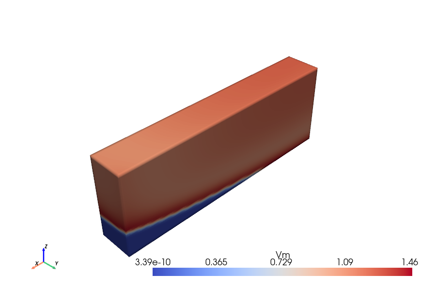
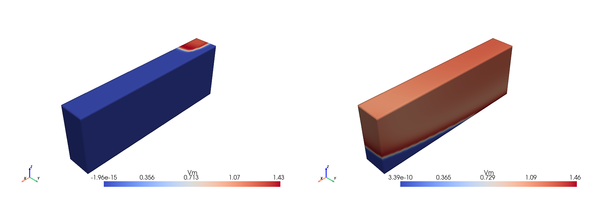
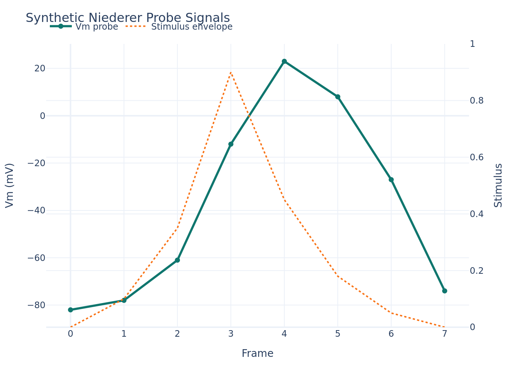

# Niederer Preview

This file gives a git-visible preview of the shipped Niederer example without
committing the full generated HTML output.

## What This Example Covers

- `4d-image`: one live Niederer slab figure
- `4d-panel`: a synced first-vs-last comparison
- `4d-timeseries`: a synchronized timestep strip
- `4d-graph`: a Plotly JSON graph embed

## Static Preview Images

### Single Figure



### Synced Panel



### Plotly Graph



## Live Render

The live static render is published by the GitHub Pages workflow in
[.github/workflows/example-preview-pages.yml](/Users/simaocastro/4Dpapers/.github/workflows/example-preview-pages.yml:1).

Locally, regenerate the example with:

```bash
COMPOSE_PROJECT_NAME=4dpapers-niederer FOURD_WORKSPACE=./examples/niederer FOURD_APP_PUBLISH=5007:5006 docker compose up -d 4dpapers
COMPOSE_PROJECT_NAME=4dpapers-niederer FOURD_WORKSPACE=./examples/niederer FOURD_APP_PUBLISH=5007:5006 docker compose exec 4dpapers quarto render main.qmd --to html
COMPOSE_PROJECT_NAME=4dpapers-niederer FOURD_WORKSPACE=./examples/niederer FOURD_APP_PUBLISH=5007:5006 docker compose down
```
